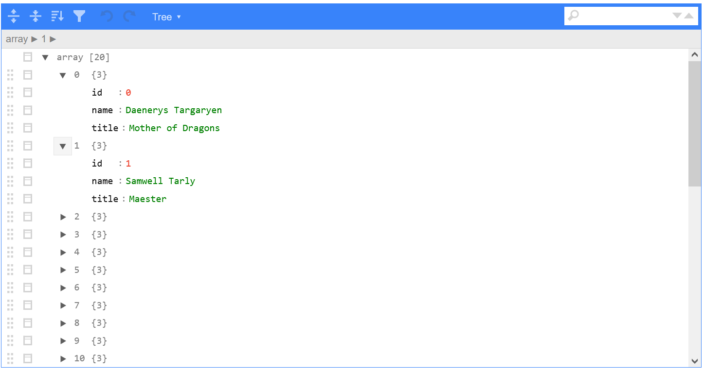

```{r setup, include=FALSE}
knitr::opts_chunk$set(echo = TRUE)

library(jsonlite)
library(tidyverse)
```


## Living in a JSON World

Being R people, we like data.  We like to get our hands on data.  The internet
is a great series of tubes particularly suited to getting you data.  People
wanted to be able to consume data in a standard format, and when the dust
settled, JSON seemed to be the winner.  So we gotta deal.

Often, data we want is rectangular, or table-like.  We often have to wrangle the
data from JSON into something that can be table-like.  Along the way, we have to
either get rid of parts that don't turn into rectangular data so easily, or
somehow wrestle it into a rectangle.


## Data Pretty Close to Rectangular

The following data is pretty close to rectangular.  It is an array of objects.  Each object has the same keynames throughout.  So you can think of this structure as each object containing a row of data, and each keyname being a column.

This data is in `simple-character-list.json`.  Note that I am not just
outputting the raw file here, but converting to an R object and then back to
JSON in a pretty format, because it is easier to do.  But the result is the
same.

```{r}
jsonSimpleChar_lst <-
    read_json(here::here("dat", "simple-character-list.json"))

jsonSimpleChar_lst %>%
    toJSON(pretty = TRUE, auto_unbox = TRUE)
```

## How do We Get This into a Dataframe?

Can I just try casting to a tibble?  You'd think, and sometimes it works, but
no, not here.
```{r}
tryCatch({
    as_tibble(jsonSimpleChar_lst)},
    error = function(e) print(e))
```

What does the parsed object even look like?
```{r}
str(jsonSimpleChar_lst, list.len = 3)

#;; Use listviewer::jsonedit() in normal interactive code, not reports.
#;; It's a handy tool.
# listviewer::jsonedit(jsonSimpleChar_lst)
```



So, it's a list of lists.

Turns out, you can get close if you *transpose* this list and then use
`as_tibble()`:
```{r}
jsonSimpleChar_lst %>%
    transpose() %>%
    as_tibble()
```

A little trickery will get you there...
```{r}
jsonSimpleChar_lst %>%
    transpose() %>%
    as_tibble() %>%
    map(unlist) %>%
    as_tibble()
```


Or even better:
```{r}
jsonSimpleChar_lst %>%
    transpose() %>%
    as_tibble() %>%
    mutate_all(unlist)
```


... *But that's all pretty ad hoc, and is fragile.  There are more regular ways that are more widely applicable.*


```{r eval=FALSE}
jsonSimpleChar_lst %>%
  transpose() %>%
  toJSON(auto_unbox = TRUE, pretty=TRUE)
```


## The `tidyr` Package and Rectangling

There is a consistent way to turn weird, semi-rectangular structures into
dataframes.  Let's just start by doing it with the tools from the `tidyr`
package.

Let's do this in steps:
```{r}
tibble(obj = jsonSimpleChar_lst) %>%
    print(n=3)
```

then:
```{r}
tibble(obj = jsonSimpleChar_lst) %>%
    unnest_wider(obj) %>%
    print(n=3)
```

### What Just Happened?

With the `tibble(obj = jsonSimpleChar_lst)` statement, we made `obj` a
*list-column*, or a column in a tibble whose values are lists.  So it is a list
of lists.

Then we called `unnest_wider(obj)`, whose first argument, with the `%>%`
operator, is actually the first tibble we made.  `unnest_wider()` then looks at
the column `obj`, and says, "Well, each row is a list of key value pairs.  I can
turn the keys into column names and values into the data entries.  And do it
consistently across all of the rows."  Which it does, and boom, you have a
tibble like you want.


### Other tricks

You can use `hoist()` to just pull out any particular key that you want, like
`name`.  When it does this, by default, it removes it from the `obj` list once
it is made into its own column.

```{r}
tibble(obj = jsonSimpleChar_lst) %>%
    hoist(obj, "name") %>%
    print(n=3)
```


What happens if you `unnest_longer()` instead?
```{r}
tibble(obj = jsonSimpleChar_lst) %>%
    unnest_longer(obj) %>%
    print(n=7)
```
You can see that you get a result, but the `obj` column now has a list-column,
but each row can have a different type.  It isn't really what we want here, but
it will be useful in other cases.


## A more complex example.

But this doesn't really pay off in the simple example, since we've shown at the
start some shortcuts that don't require doing hoisting and unnesting.  Let's
look at a gnarly example.

```{r}
jsonComplex_lst <-
    read_json(here::here("dat", "complex-json.json"))

#listviewer::jsonedit(jsonComplex_lst)
```


There's a lot going on here.  Too much to explain.  But it is a real life
example that I had to recently sort through to get information from a bunch of
files like this to compare across them.

I'm not going to explain it all.  Instead, I am going to give a sequence of
unnest/hoist calls that got out the data under `parameters`.  There are 6
parameters, each of which is a time series of values.  I want those 6 parameters
in dataframes that I can stitch together to inspect.

Let's go down a rabbit hole.

```{r}
parameters_df <-
  tibble(obj=jsonComplex_lst) %>%
  filter(names(obj) == "data") %>%
  unnest_longer(obj) %>%
  unnest_wider(obj) %>%
  select(tisObjectId, parameters) %>%
  unnest_longer(parameters) %>%
  unnest_wider(parameters) %>%
  select(tisObjectId, parameterName=name, values) %>%
  unnest_longer(values) %>%
  unnest_wider(values) %>%
  mutate(value = unlist(value)) %>%
  pivot_wider(names_from = "parameterName", values_from = "value")
  
knitr::kable(parameters_df)
```


## References

- Rectangling Vignette, tidyr: https://tidyr.tidyverse.org/articles/rectangle.html

