Turning JSON into Dataframes
========================================================
author: Matt Pettis (matthew.pettis@gmail.com)
date: 2021-10-28
autosize: true

Who am I?
========================================================
incremental: true

- Matt Pettis.  Hi.
- Sr. Data Scientist, TraneTechnology
- Avid something-something.


Common JSON Input
========================================================
```
[
    {
        "id": 0,
        "name": "Daenerys Targaryen",
        "title": "Mother of Dragons"
    },
    {
        "id": 1,
        "name": "Samwell Tarly",
        "title": "Maester"
    },
    ..
]
```


Common JSON Input, parsed by jsonlite
========================================================


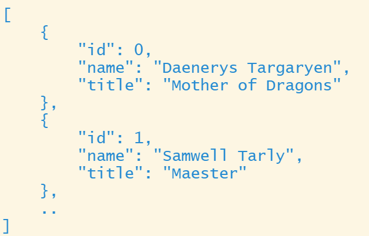

***
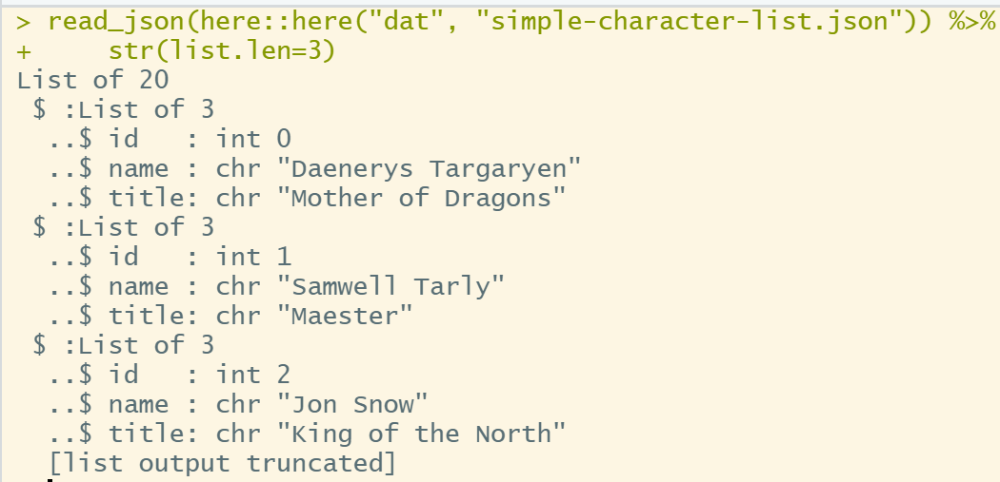


Common JSON Input, converting to dataframe, simple try
========================================================
From this form, we get an error.

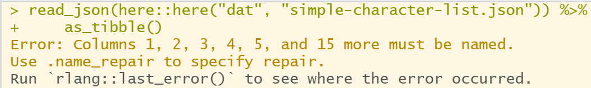


Common JSON Input, converting to dataframe, extra work
========================================================

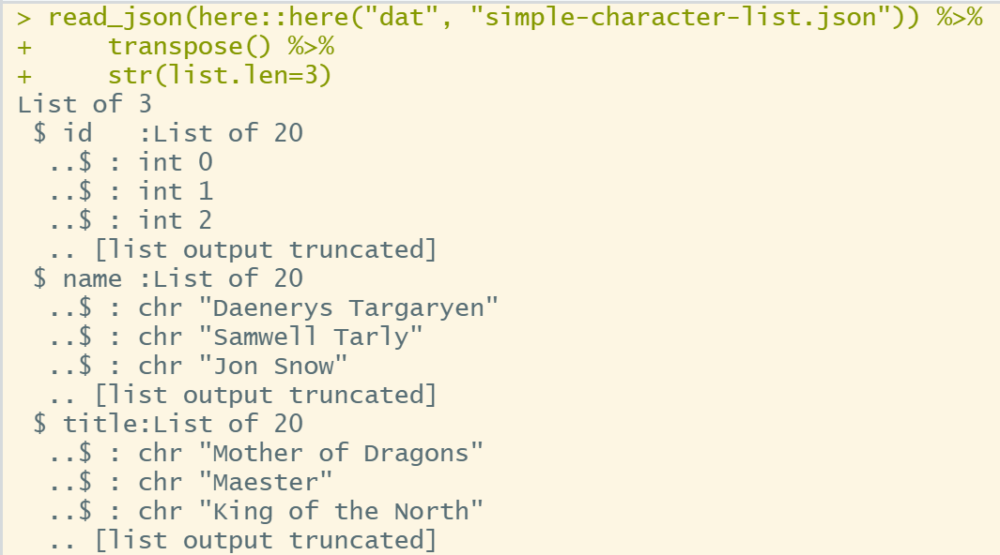


Common JSON Input, converting to dataframe, extra work
========================================================

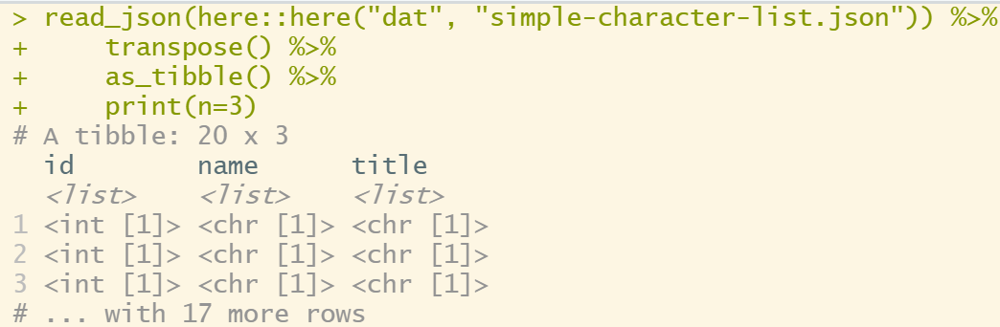


Common JSON Input, converting to dataframe, extra work
========================================================

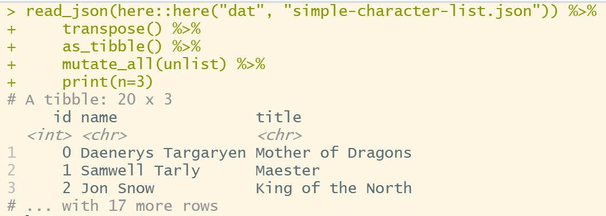


Common JSON Input, tidyr Rectangling API
========================================================
Stick the list in a table, and unnest it.

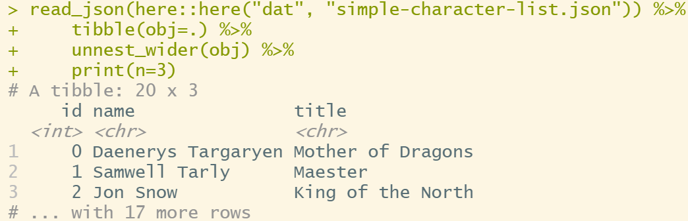


Common JSON Input, tidyr Rectangling API
========================================================
You can use `hoist()` to pick out only parts you want.

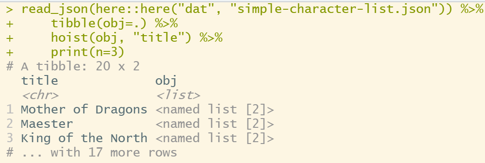


`tidyr` Rectangling: The Deep End Demo
========================================================
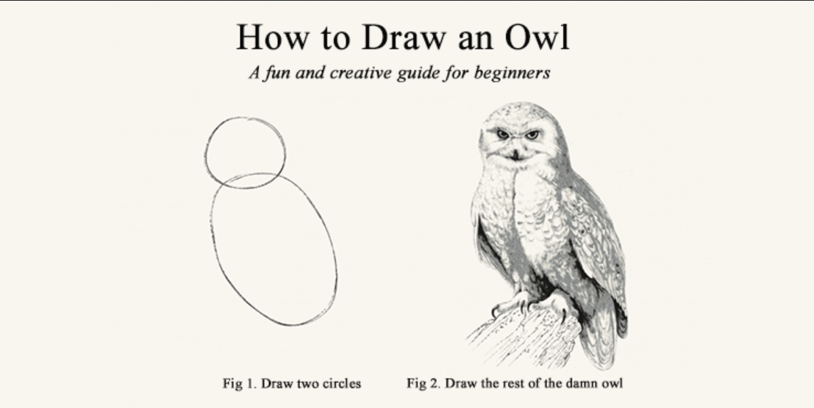


`tidyr` Rectangling: The Deep End Demo
========================================================

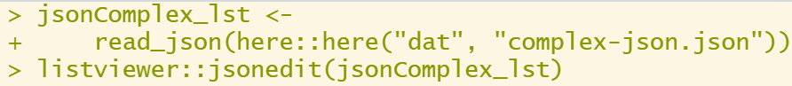
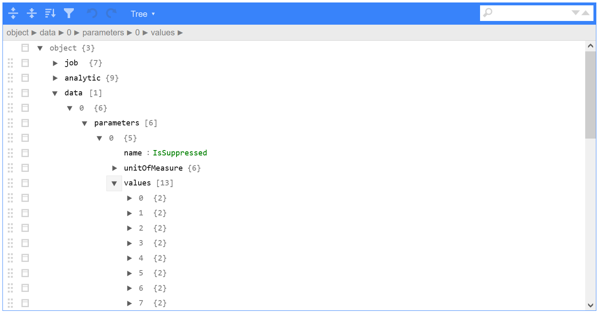


`tidyr` Rectangling: The Deep End Demo
========================================================
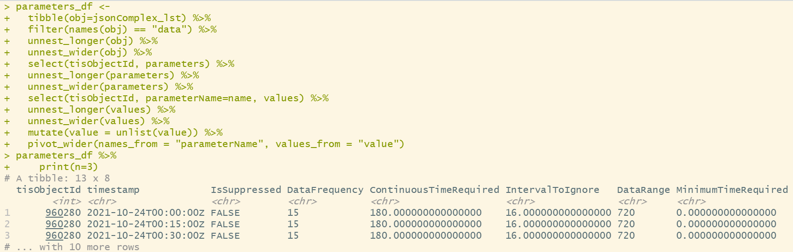


References
========================================================
- Rectangling Vignette, tidyr: https://tidyr.tidyverse.org/articles/rectangle.html
